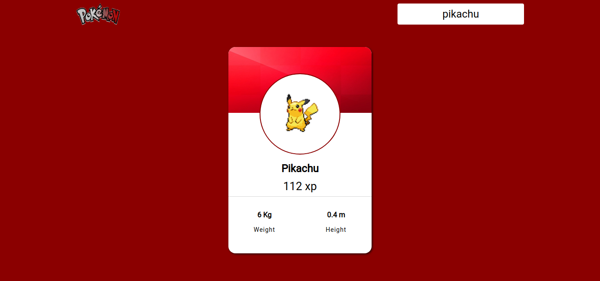

<h1 align="center">
  <br>
    
  <br>
  Pokémon Card
</h1>
<p align="center">Link: <a href="https://emanuelv15-quiz-app.vercel.app/">Pokémon Card</a></p>

<p align="center">By: <a href="http://github.com/emanuelv15">Emanuel Vitor Souza</a></p>

<p align="center">
  <a href="https://opensource.org/licenses/MIT">
    
  </a>
</p>

## 📜 Features

<ul>
  <li><p>Application that allows you to search pokémons by their names or numbers, the pokémon found will be shown on a card containing your photo, name, base xp, height and weight.</p></li>
</ul>

<div align="center">
  
</div>

## 🧰 Techs

[//]: # "Add the features of your project here:"

🔷 **ReactJS;**
🔷 **Babel;**
🔷 **Webpack;**
🔷 **Axios;**
🔷 **Polished;**
🔷 **Styled Components;**
🔷 **Toastify;**
🔷 **Typescript.**


## 💻 Getting started

```bash
# Clone this repository
$ git clone https://github.com/emanuelv15/pokemon-card.git

# Enter the folder
$ cd pokemon-card

# Install the dependencies
$ yarn

# To start the project
$ yarn start

# The app will start up in <http://localhost:3000>

```

## 🤓 How to contribute

<ul>
  <li>Fork this repository;</li>
  <li>Create a branch with your feature: <code>git checkout -b my-feature</code>;</li>
  <li>Commit your changes: <code>git commit -m 'feat: My new feature'</code>;</li>
  <li>Push to your branch: <code>git push origin my-feature</code>.</li>
</ul>

<p>After the merge of your pull request is done, you can delete your branch.</p>

## ✍️ License

This project is licensed under the MIT License - see the [LICENSE](https://opensource.org/licenses/MIT) page for details.

<a href="http://github.com/emanuelv15">Emanuel Vitor Souza</a>
